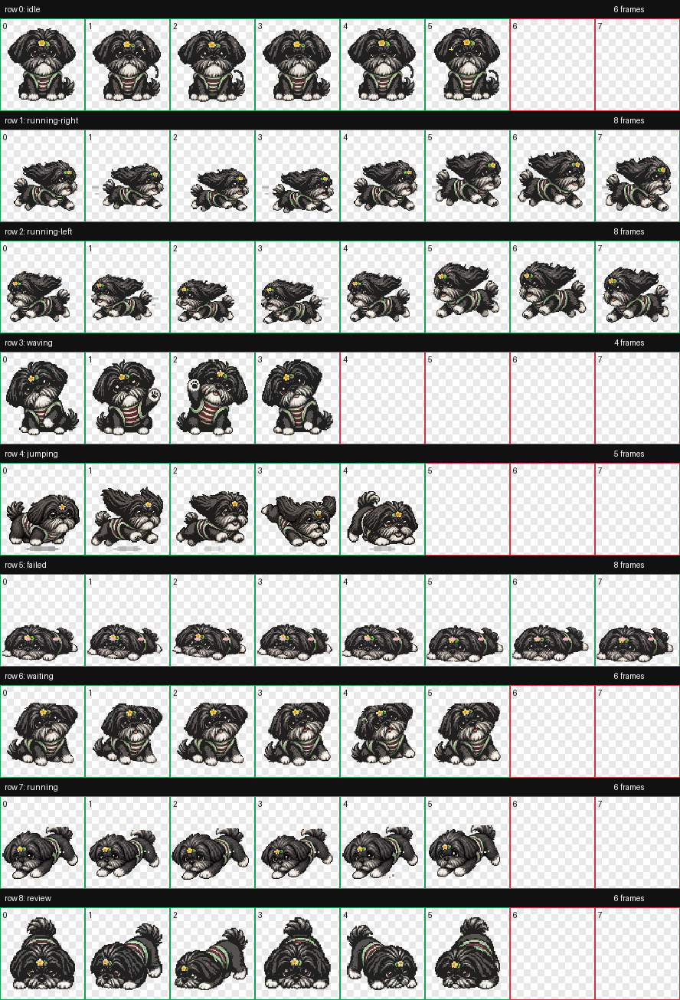
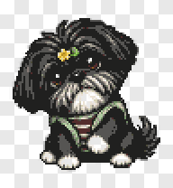
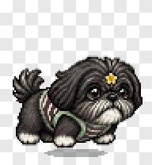
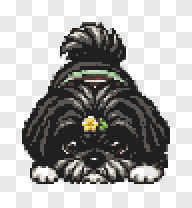

# Udon Work Buddy

Udon Work Buddy is a custom Codex/OpenPet-style desktop pet package based on Udon, a gray-black Shih Tzu. It includes a Codex-compatible 8x9 spritesheet, manifest, preview GIFs, and the local build script used to regenerate the pet atlas.

Repository:

```text
git@github.com:yf2388/udon-work-buddy.git
```

## Codex Auto Configuration

Use this section when another Codex agent only receives the GitHub repository address and needs to configure the pet automatically.

Goal: install the `Udon` custom desktop pet into the active Codex home so the local Codex app can load it.

Expected result:

- `${CODEX_HOME:-$HOME/.codex}/pets/udon/pet.json` exists.
- `${CODEX_HOME:-$HOME/.codex}/pets/udon/spritesheet.webp` exists.
- Codex can show `Udon` in the pet selection UI after restart or refresh.

Recommended agent workflow:

1. Clone the repository into a temporary or user-approved workspace.

   ```bash
   git clone git@github.com:yf2388/udon-work-buddy.git
   cd udon-work-buddy
   ```

2. Run the installer from the repository root.

   ```bash
   ./tools/install_udon_pet.sh
   ```

3. Verify the installed files.

   ```bash
   test -f "${CODEX_HOME:-$HOME/.codex}/pets/udon/pet.json"
   test -f "${CODEX_HOME:-$HOME/.codex}/pets/udon/spritesheet.webp"
   ```

4. If Codex is already running and the pet does not appear, restart Codex. Then select `Udon` from the Codex appearance/pet settings.

Non-interactive one-liner:

```bash
git clone git@github.com:yf2388/udon-work-buddy.git && cd udon-work-buddy && ./tools/install_udon_pet.sh
```

If SSH access to GitHub is not configured, use the HTTPS URL instead:

```bash
git clone https://github.com/yf2388/udon-work-buddy.git
cd udon-work-buddy
./tools/install_udon_pet.sh
```

Notes for Codex agents:

- Do not initialize git in the parent workspace when configuring this pet.
- Do not copy unrelated workspace files into this repository.
- The installer only writes `pet.json` and `spritesheet.webp` into the Codex pet directory.
- Respect `CODEX_HOME` when it is set; otherwise use `$HOME/.codex`.
- Ask for elevated filesystem permission only if writing to the Codex home is blocked by the local sandbox.

## Preview



Selected animation previews:





## Pet States

The spritesheet follows the Codex custom pet contract:

- Canvas: `1536x1872`
- Grid: `8` columns x `9` rows
- Cell: `192x208`
- Format: `spritesheet.webp`
- Manifest: `pet.json`

Rows:

1. `idle`
2. `running-right`
3. `running-left`
4. `waving`
5. `jumping`
6. `failed`
7. `waiting`
8. `running` / working
9. `review`

## Install

From this repository root:

```bash
./tools/install_udon_pet.sh
```

Or copy manually:

```bash
mkdir -p "${CODEX_HOME:-$HOME/.codex}/pets/udon"
cp codex-pets/udon/pet.json codex-pets/udon/spritesheet.webp "${CODEX_HOME:-$HOME/.codex}/pets/udon/"
```

Then restart Codex if the pet list does not refresh, and choose `Udon` from Settings -> Appearance -> Pet.

## Rebuild

The build script uses the checked-in source sheets under `codex-pets/udon/` and writes a regenerated atlas plus preview artifacts.

```bash
python3 tools/build_udon_pet.py
```

The script requires Pillow:

```bash
python3 -m pip install Pillow
```

## Files

- `codex-pets/udon/pet.json`: Codex pet manifest.
- `codex-pets/udon/spritesheet.webp`: production custom-pet spritesheet.
- `codex-pets/udon/contact-sheet.png`: visual QA sheet.
- `codex-pets/udon/previews/*.gif`: per-state animation previews.
- `codex-pets/udon/udon-*.png`: source/reference sheets used by the build script.
- `tools/build_udon_pet.py`: deterministic atlas/preview builder.
- `tools/install_udon_pet.sh`: local Codex install helper.
